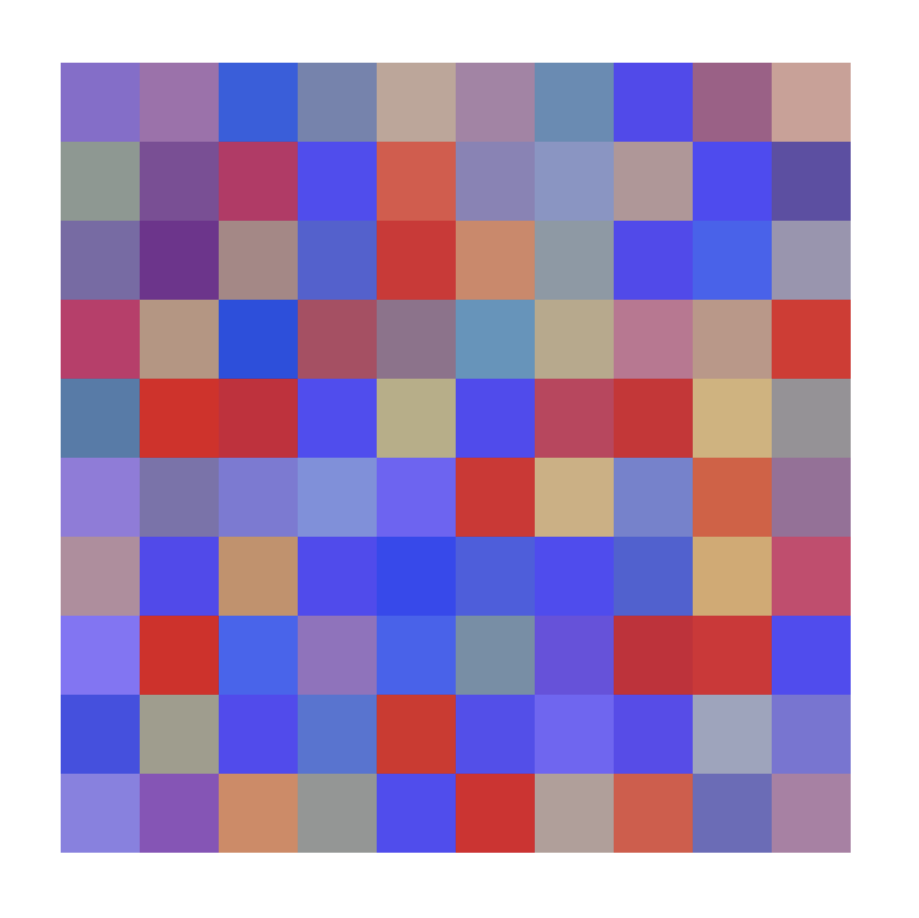
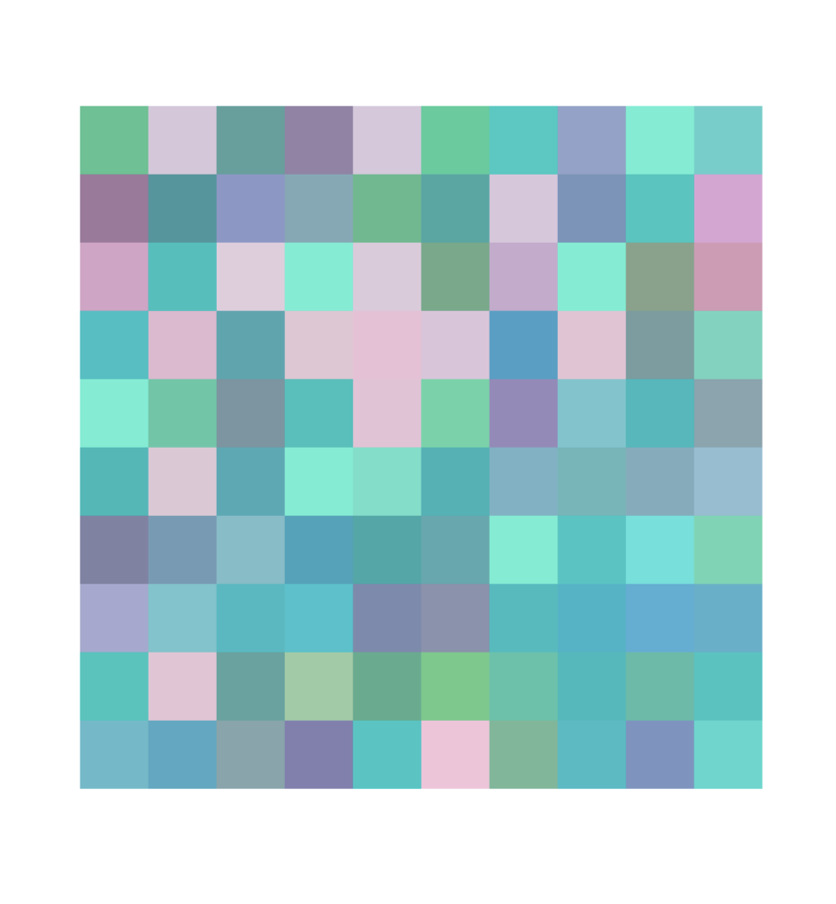
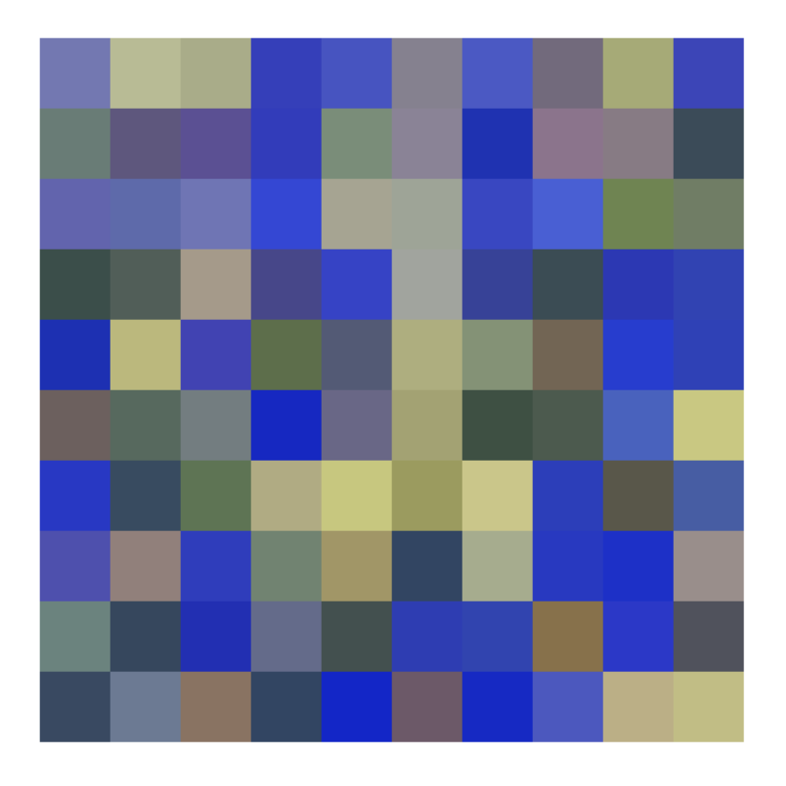
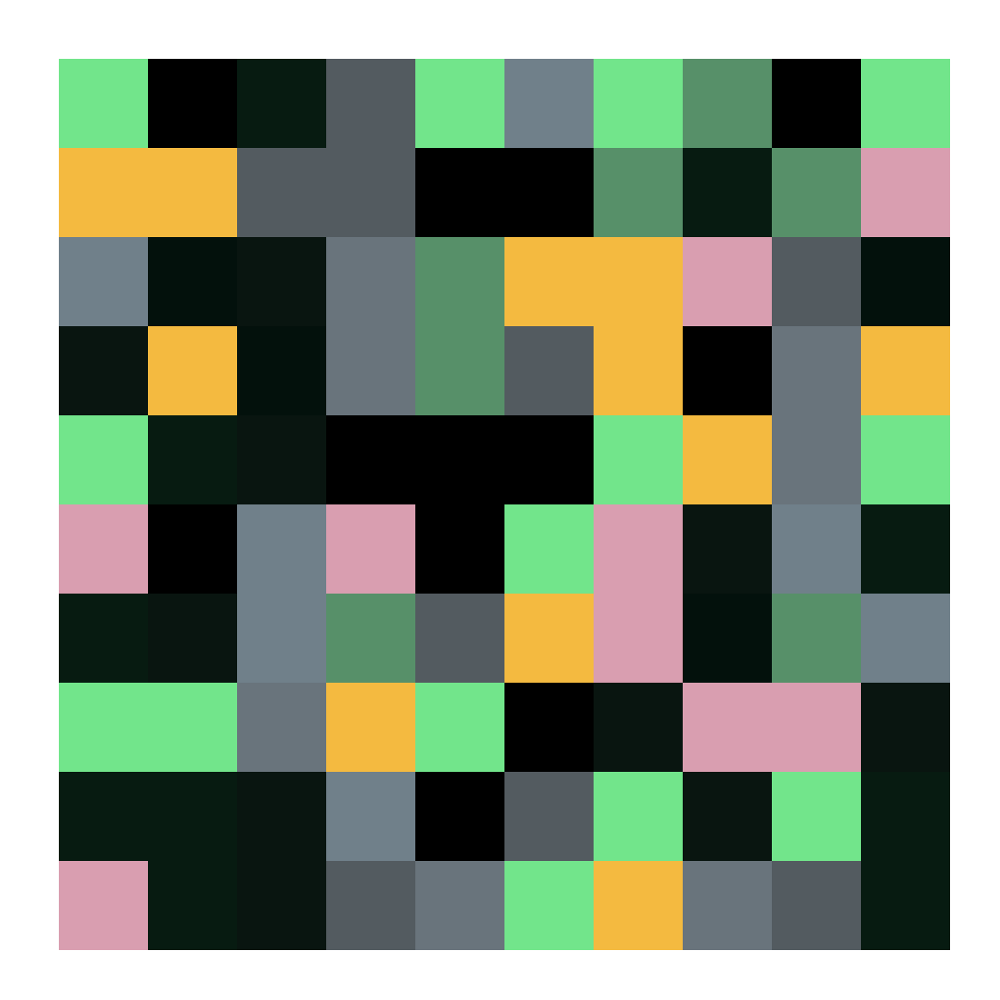

# 🎨 Compte rendu

## Exercice 2

*Le code source est disponible dans le dossier **exo02**.*

**1 - Duel au sommet (Combativité)**
Le bleu et le rouge, majoritaires, s'affrontent pour la conquête du territoire. La population ne sait plus où se mettre.

**2 - Complètement givré (Fraicheur)**
Comme un grand vent de fraicheur ! Les flaucons sont de la partie.

**3 - Fonds marins (Profondeur)**
Discernez-vous les algues et les rochers à travers l'eau ?

**4 - Parasite (Angoissant)**
Comme un élément étranger qui prend le contrôle de son hôte.

